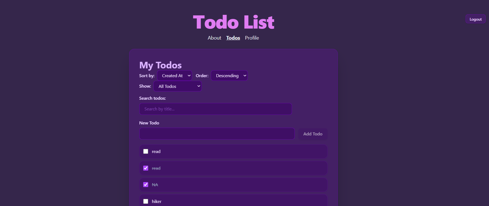
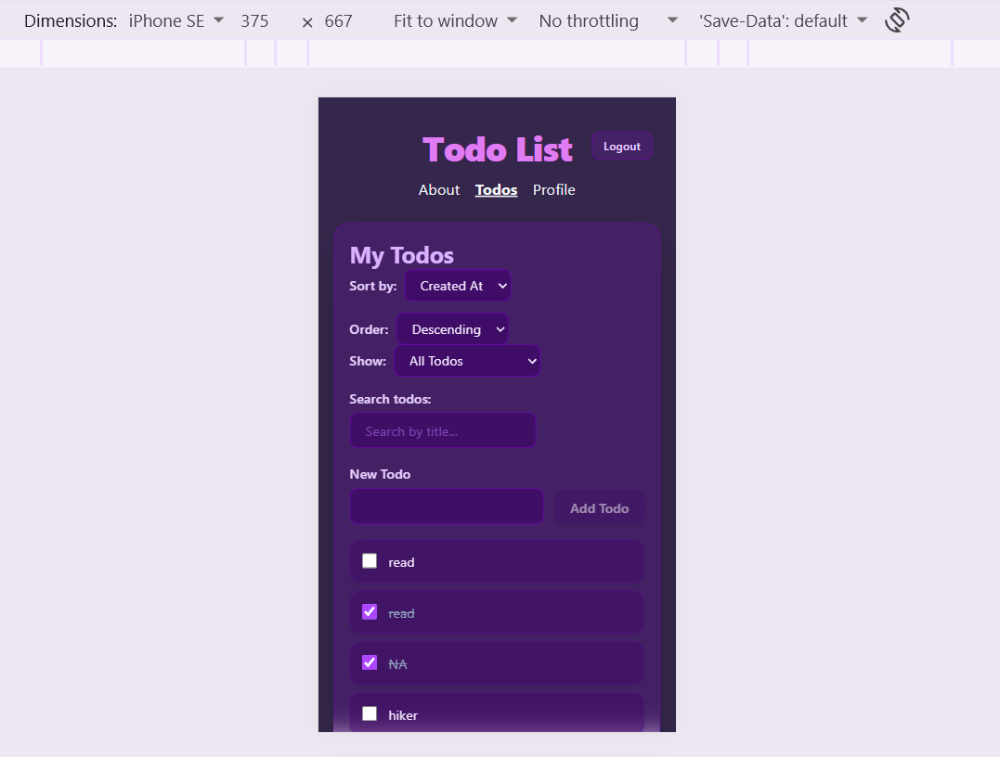

# ✅ Todo List — TaskFlow

> A personal task management app that helps you organize, track, and complete your daily to-dos — with a clean, modern dark UI built on React and Vite.

---

## 🌐 Live Demo

🔗 [View Live Application](https://taskflow-app-mu-livid.vercel.app) 

---

## ✨ Features

- **Add Todos** — Quickly create new tasks via an input form
- **Mark Complete** — Toggle tasks between active and completed states
- **Edit Todos** — Inline editing to update task titles
- **Filter by Status** — View All, Active, or Completed todos via URL query params
- **Search / Filter** — Debounced text input to instantly search tasks by name
- **Sort Todos** — Sort by creation date or title, ascending or descending
- **Authentication** — Secure login with session-based auth and CSRF token support
- **Protected Routes** — Todos and Profile pages require authentication
- **Auto-redirect** — After login, users are sent to their originally intended page
- **Logout** — One-click sign-out that clears the session
- **Optimistic Updates** — UI updates instantly before server confirmation, with rollback on error
- **Loading States** — Visible loading indicator while fetching data
- **Error Handling** — Friendly error messages with clear/reset actions
- **Responsive Design** — Fully usable on mobile, tablet, and desktop

---

## 🛠️ Technologies Used

| Category         | Technology                              |
|------------------|-----------------------------------------|
| Framework        | [React 19](https://react.dev/)          |
| Build Tool       | [Vite 8](https://vite.dev/)             |
| Routing          | [React Router 7](https://reactrouter.com/) |
| Styling          | [Tailwind CSS v4](https://tailwindcss.com/) |
| State Management | React `useReducer` + Context API        |
| API Proxy        | Vite dev server proxy (`/api` → backend)|
| Linting          | ESLint with React Hooks plugin          |
| Language         | JavaScript (ES Modules, JSX)            |

---

## 📸 Screenshots

### 🖥️ Desktop View




### 📱 Mobile View


---

## 🚀 Getting Started

### Prerequisites

Make sure you have the following installed:

- [Node.js](https://nodejs.org/) **v18 or higher**
- [npm](https://www.npmjs.com/) (comes with Node.js)
- A running backend API server (the app proxies requests to it via `/api`)

### Installation

1. **Clone the repository:**

   ```bash
   git clone https://github.com/AnnnAPr/todo-list.git
   cd todo-list
   ```

2. **Install dependencies:**

   ```bash
   npm install
   ```

3. **Set up environment variables:**

   Create a `.env` file in the project root:

   ```env
   VITE_TARGET=http://localhost:your-backend-port
   ```

   Replace `http://localhost:your-backend-port` with the URL of your backend API server.

4. **Start the development server:**

   ```bash
   npm run dev
   ```

   The app will be available at **http://localhost:3001**

---

## 📜 Available Scripts

| Script          | Command           | Description                                                              |
|-----------------|-------------------|--------------------------------------------------------------------------|
| **dev**         | `npm run dev`     | Starts the local development server at `http://localhost:3001` with HMR  |
| **build**       | `npm run build`   | Bundles the app for production into the `dist/` folder                   |
| **preview**     | `npm run preview` | Serves the production `dist/` build locally to test before deploying     |
| **lint**        | `npm run lint`    | Runs ESLint to check for code quality issues                             |

---

## 🎨 Design Decisions

### Dark Purple Theme
The app uses dark purple colors with semi-transparent, frosted-glass-style cards — giving it a sleek, modern look.

### Tailwind CSS v4
Tailwind CSS v4 (with the new Vite plugin) was chosen for its utility-first approach, enabling rapid styling directly in JSX without leaving the component. This keeps styles co-located with the markup they affect, making components easy to read and maintain.

### `useReducer` for Todo State
Rather than scattered `useState` calls, all todo state — including loading, error, filter, sort, and the list itself — is managed in a single `useReducer`. This makes state transitions explicit, predictable, and easy to trace during debugging.

### Optimistic UI Updates
When a user adds, completes, or edits a todo, the UI updates immediately before the server responds. If the server call fails, the change is rolled back. This makes the app feel fast and responsive even on slower connections.

### Debounced Search
The filter/search input uses a custom `useDebounce` hook (300ms delay) to avoid sending an API request on every keystroke, reducing unnecessary network traffic.

### URL-based Status Filter
The active/completed filter state lives in the URL as a `?status=` query parameter. This means filter state is shareable, bookmarkable, and survives page refreshes — a pattern that feels native to the web.

---

## 🔮 Future Improvements

- **Due Dates & Reminders** — Add optional due dates with browser notifications
- **Drag-and-Drop Reordering** — Allow manual reordering of todo items
- **Tags / Categories** — Group todos by project or label
- **Dark / Light Mode Toggle** — Let users switch between themes
- **Pagination** — Handle large task lists with paging or infinite scroll
- **Offline Support** — Cache todos with a service worker for offline use
- **Animations** — Smooth entrance/exit animations for todo items using Framer Motion
- **User Registration** — Allow new users to sign up from within the app
- **Accessibility Audit** — Full WCAG 2.1 AA compliance review

---

## 📄 License

This project is licensed under the **MIT License**.

```
MIT License

Copyright (c) 2026 Anna

Permission is hereby granted, free of charge, to any person obtaining a copy
of this software and associated documentation files (the "Software"), to deal
in the Software without restriction, including without limitation the rights
to use, copy, modify, merge, publish, distribute, sublicense, and/or sell
copies of the Software, and to permit persons to whom the Software is
furnished to do so, subject to the following conditions:

The above copyright notice and this permission notice shall be included in all
copies or substantial portions of the Software.

THE SOFTWARE IS PROVIDED "AS IS", WITHOUT WARRANTY OF ANY KIND, EXPRESS OR
IMPLIED, INCLUDING BUT NOT LIMITED TO THE WARRANTIES OF MERCHANTABILITY,
FITNESS FOR A PARTICULAR PURPOSE AND NONINFRINGEMENT. IN NO EVENT SHALL THE
AUTHORS OR COPYRIGHT HOLDERS BE LIABLE FOR ANY CLAIM, DAMAGES OR OTHER
LIABILITY, WHETHER IN AN ACTION OF CONTRACT, TORT OR OTHERWISE, ARISING FROM,
OUT OF OR IN CONNECTION WITH THE SOFTWARE OR THE USE OR OTHER DEALINGS IN THE
SOFTWARE.
```

---

## 👤 Contact

- **GitHub:** [@AnnnAPr](https://github.com/AnnnAPr)

---

*Built with 💜 using React + Vite + Tailwind CSS*
